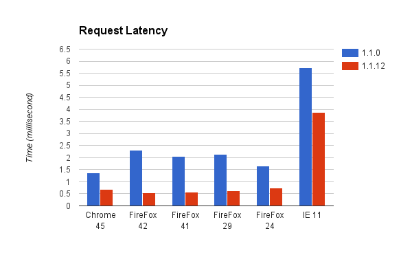

## Improvements since 1.1.0
As of 1.1.12, the IWC has been optimized to utilize shared workers as well as undergone an overall code cleanup.
The results of this has given some significant speed improvements for the IWC Client. 

### Testbench
The test used for this benchmarking could use some improvements, the latency averages should not be of
concern to developers as the results are proportional to the machine ran on. The garbage collection of 
each browser tested took over control a few times during each test causing some spikes in latency as well.
Running the testbench a few times showed about a ±10% on the results.
 
### The test
To test latency, an IWC client was used to make a `set` request and wait for a response. Once a response was
received it would make another request. This is repeated 10 times per run. After 10 request/responses the average
latency is computed for the run. To try and isolate any browser computation blocking, there are 500 runs per overall
test.

***

### Results

| Browser    | v1.1.0 | v1.1.12 | % Faster |
|------------|--------|---------|----------|
| Chrome 45  | 1.3792 | 0.6878  | 50.13%   |
| FireFox 42 | 2.2988 | 0.5402  | 76.50%   |
| FireFox 41 | 2.0472 | 0.5792  | 71.71%   |
| FireFox 29 | 2.1272 | 0.6368  | 70.06%   |
| FireFox 24 | 1.6454 | 0.732   | 55.51%   |
| IE 11      | 5.7396 | 3.88    | 32.40%   |

#### Chrome/FF
Only tested against version 45  of chrome thus far. Our firefox baseline, the initial version of firefox allowing
shared workers (29) and the latest 2 releases of firefox have been tested. Across these two browsers throughput
of IWC messages has doubled.

#### IE
IE 11 has limited support for IWC. Without putting time into specific IE enhancements, throughput has gone up by
almost a third.